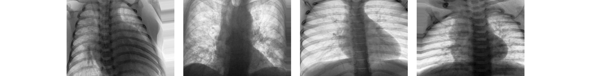
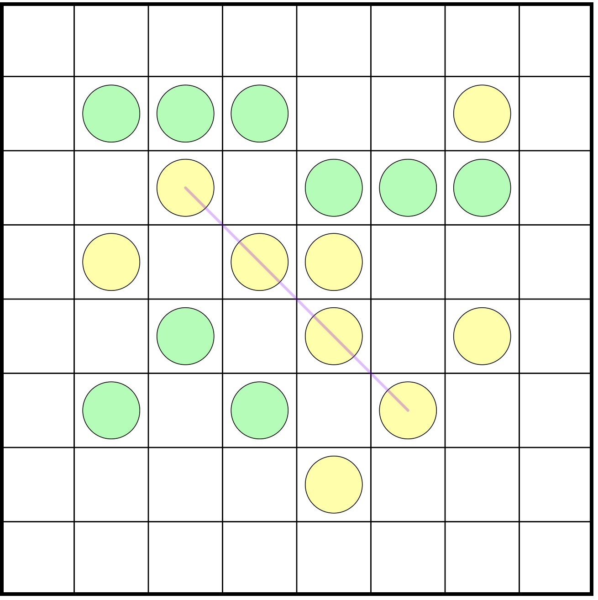
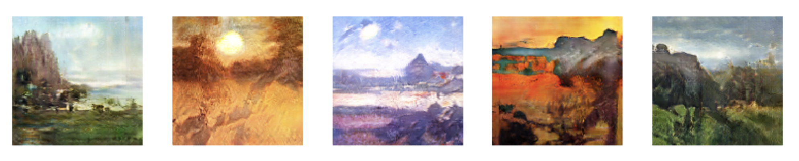
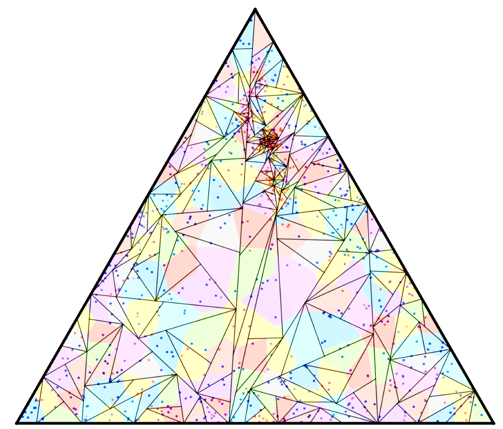
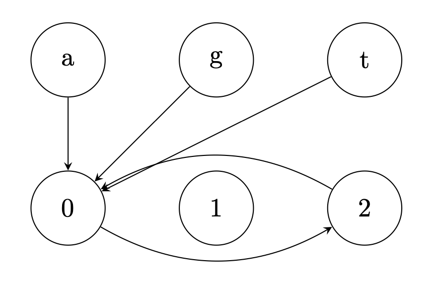

# Projects 2018 - 2020

## Synthesis of Recent Advances in Massively Parallel Computation (2020)
Spearheaded a team of three to write a technical paper threading together recent works devoted to MPC algorithms for graph and DP problems.
<a href="Advanced_Algorithms_Project.pdf" target="_blank" >  Read the paper here </a>

## Kaggle Covid-19 Competition (2020)

Cleaned and augmented data; trained a CNN to diagnose based on patients’ chest x-rays; achieved over 80% weighted accuracy with fewer than 1200 training samples.
See <a href="ML_Project_Report.pdf" target="_blank"> here </a> for detailed methodology and results.

## Connect 4 (2020)
 A variation on Connect 4 I built to learn about HTML5 Canvas.

<h2> <a href="https://john-daciuk.github.io/pente-js/" target="_blank"> Play here </a> </h2>

 

## Simon (2020)
A challenging memory game I built while learning Javascript through Angela Yu's web development course on Udemy.
<a href="https://john-daciuk.github.io/simon-game/" target="_blank"> Play here (2020) </a>

## Landscape Painting with GANs (2019)

Scraped the web for 20,000 paintings and used Google cloud GPUs to train DCGANs; created thousands of beautiful and novel paintings in 128x128 resolution.
<a href="DL-final-project training.html" target="_blank"> Learn more about the data collection and training </a>
<a href="DL-final-project-results.html" target="_blank"> See generated paintings and analysis of trained GANs </a>

## Reinforcement Learning Project (2019)
Researched and implemented theory to train linear models from scratch and neural nets with TensorFlow for OpenAI Gym control environments.
<a href="rl.html" target="_blank"> See the jupyter notebook </a>

## Programming and Problem Solving Projects (2019)
 &nbsp;&nbsp; 

PPS is a course I took at columbia which emphasizes collaboration on difficult open-ended problems to be solved through programming.  For the project 'Lunch' <a href="lunch.pdf" target="_blank"> (see our paper) </a> my team built an autonomous agent capable of coordinating strategy with the other teams' agents.  For the project 'Mutation', my team used theory from causal inference to build a model capable of predicting underlying mutation rules from many observations of digital experiments <a href="mutation.pdf" target="_blank"> (read our mathematical analysis) </a>.  For another project my team analyzed the robustness of different systems of voting and representation to gerrymandering.  We tessellated a fictitious country of 300,000+ voters with Voronoi districts and simulated results using SciPy and Monte-Carlo techniques <a href="threeland.pdf" target="_blank"> (see a detailed exposition of our techniques) </a>.  The project 'Flip', similar to 'Lunch', emphasized building an agent that could strategize dynamically.  We had a class tournament to simulate hundreds of 1 on 1 matches between the different teams and my team came in 2nd place out of 8 <a href="flip.pdf" target="_blank"> (see our report) </a>.

## Pente for iOS (2018) 
Developed a grid-based game with Swift and principled MVC design that adapts to any device size; leveraged Google Firebase to allow online play; used custom view classes and protocols.

## Comparative Analysis of SGD Optimization Variants (2018)
Produced insightful animations with NumPy and matplotlib to accentuate convergence differences between AdaDelta, Adam and AdaGrad algorithms. <a href="GD_animations.html" target="_blank"> See the jupyter notebook </a>

## Playlist Recommendation with Spotify’s Million Playlist Dataset (2018)
Utilized Python, Pandas, scikit-learn and random forests to build a recommendation system able to generate playlists; evaluated with r-precision.
<a href="https://tralpha.github.io/spotify-project/project-statement-and-goals.html" target="_blank"> See my team's work here </a>

